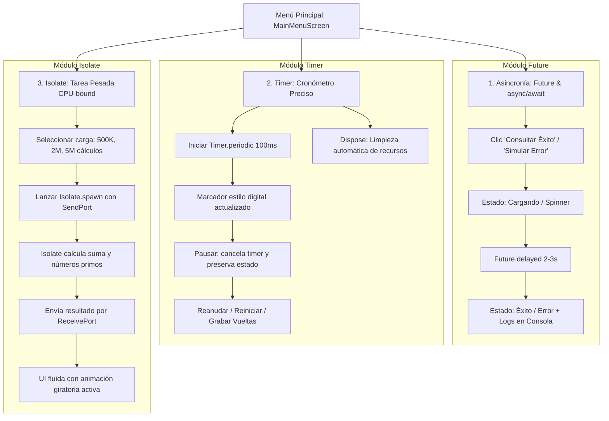

# Taller 2: Asincronía y Tareas en Segundo Plano en Flutter

**Estudiante:** Manuel Alejandro Ramirez Bravo  
**Correo Electrónico:** rmanuelalejandro616@gmail.com  
**Tecnología:** Flutter & Dart  

---

## 📌 1. ¿Cuándo usar Future, async/await, Timer e Isolate?

| Herramienta | Cuándo Usarla | Tipo de Tarea | ¿Bloquea la UI si se usa mal? |
| :--- | :--- | :--- | :--- |
| **`Future` / `async` / `await`** | Para operaciones de **E/S (I/O-bound)** como peticiones HTTP a APIs REST, lecturas/escrituras en SQLite/SharedPreferences, o retardos programados. Se procesa dentro del Event Loop del hilo principal. | I/O-bound, eventos futuros asíncronos | No bloquea la UI mientras espera eventos de E/S. Si se ejecuta un bucle pesado de CPU dentro de un `Future`, **sí** congelaría la UI. |
| **`Timer` / `Timer.periodic`** | Para ejecutar callbacks después de un intervalo de tiempo o repetidamente a intervalos regulares (cronómetros, cuentas regresivas, polling periódico). Se debe cancelar en `dispose()` para prevenir fugas de memoria (*memory leaks*). | Basada en tiempo | No bloquea por el tiempo en sí, pero la función ejecutada en cada tick debe ser ligera para mantener los 60/120 FPS. |
| **`Isolate` (`Isolate.spawn`)** | Para tareas **intensivas en cálculo de CPU (CPU-bound)** como procesamiento de imágenes, cifrado/hashing pesado, compresión, o cálculo de algoritmos complejos sobre millones de registros. Corre en un hilo de sistema operativo independiente con su propio heap de memoria. | CPU-bound intensivo | **Garantiza cero bloqueo de la UI**, ya que no comparte memoria ni compite por el Event Loop principal de renderizado. |

---

## 📱 2. Arquitectura de Pantallas y Flujos de la Aplicación



---

## 🔄 3. Flujo de Trabajo GitFlow Implementado

1. **Rama `main`**: Código estable y versiones entregables.
2. **Rama `dev`**: Rama base de integración y desarrollo continuo.
3. **Rama `feature/taller_segundo_plano`**: Rama de trabajo donde se implementaron los requisitos del taller.
4. **Flujo de Integración**:
   - `feature/taller_segundo_plano` -> Pull Request a `dev`.
   - Revisión y Merge de `dev` -> `main`.

---

## 🚀 4. Cómo Ejecutar la Aplicación en Android Studio

1. Abrir la carpeta del proyecto en **Android Studio** (`File -> Open -> async_workshop_app`).
2. Abrir una terminal o emulador (Android / Windows / Web / iOS).
3. Obtener paquetes (si es necesario):
   ```bash
   flutter pub get
   ```
4. Ejecutar la aplicación:
   ```bash
   flutter run
   ```
5. Ejecutar las pruebas unitarias y de widgets:
   ```bash
   flutter test
   ```

---


